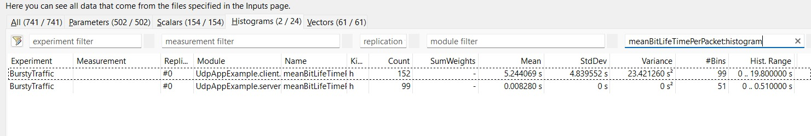
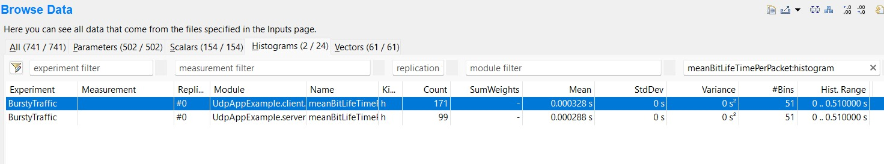

# UDP BIT LIFE OBSERVATION
Mean bit life in a UDP app has been compared for different packet lengths on OMNET++ using INET framework.


```
datarate = 1Mbps;
*.server.app[0].source.burstProducer.packetLength = 60000B
*.server.app[0].source.normalProducer.packetLength = 60000B
```


```
datarate = 1Mbps;
*.server.app[0].source.normalProducer.packetLength = 6B
*.server.app[0].source.burstProducer.packetLength = 6B
```